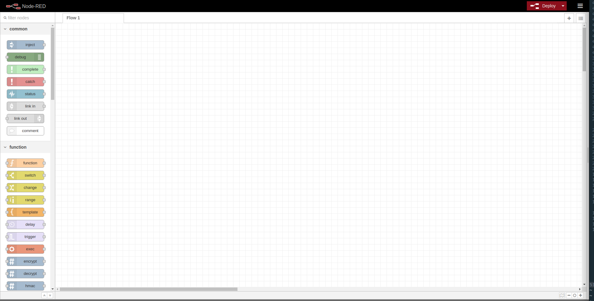
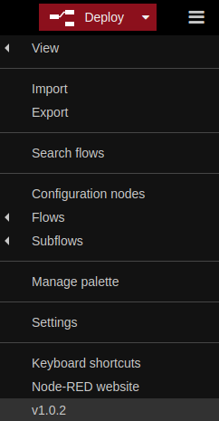
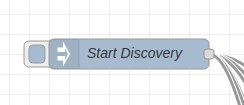

# Body Area Network - Project 4
powered by
[](https://nodesource.com/products/nsolid)

The project demonstratess scalable communication protocols which can be used in Body Area Network as well as for use in Energy constrained environment of Wireless Sensor Networks (WSN)
In this project a team 4 attempted to design a communication protocol that would allow sensors in a WSN communicate with each other in a peer to peer setting. This communication protocol needed to be dynamic enough so it could be easily and effectively applied to Body Area Networks (BAN), Unmanned Aerial Vehicles and Vehicular settings. 


### Tech

BAN uses a number of open source projects to work properly:

* [https://nodered.org/] - Low-code programming for event-driven applications
* [node.js] - evented I/O for the backend
* [https://mosquitto.org/] - An open source MQTT broker

### Installation

Dillinger requires [Node.js](https://nodejs.org/) v4+ to run.

* Install Node from [here](https://nodejs.org/)
* Install Mosquitto from [here](https://mosquitto.org/)
* Install Node-Red using this [link](https://nodered.org/docs/getting-started/local) 

Install the dependencies and start the server.

```sh
$ node-red
```
you should see
```sh
$ Welcome to Node-RED
===================

28 Nov 13:59:04 - [info] Node-RED version: v1.0.2
28 Nov 13:59:04 - [info] Node.js  version: v13.0.1
```

If mosquitto broker is installed properly, you will be able to see 

```sh
28 Nov 13:59:05 - [info] Starting flows
28 Nov 13:59:06 - [info] Started flows
28 Nov 13:59:06 - [info] [mqtt-broker:Localhost] Connected to broker: mqtt://localhost:1883
```

Application will be Launched on browser 
```sh
localhost:1880
```
### Installing additional packages

Open Manage palette
Install the follwing dependencies
* node-red-dashboard - 2.17.1
* node-red-contrib-sensor-ds18b20

### Starting NODE-RED

Open shell/command-prompt and the jump to the project directory run the below command to start Node-RED.

```
node-red
```

This will bring up the following window.



### Importing Flow

Next step for simulation is to import the discovery and communication flow into Node-Red.

To do so, we should first open the menu from the top left button and the click import. After that we select `discovery.json` and `communication.json` from the current directory.



## Running Simulation

### Discovery

Select the **Discovery** flow and click on **Deploy** button on the top. And to start the simulation click on the **Start Discovery** button as shown in the image below.



Discovery protocol will be running in the **Discovery Protocol** tab and communication protocol will be running in **Communication Protocol** tab.

## Implementation

To simulate discovery and communication the project uses MQTT channel to simulate wireless communication channel. Every node belong belong to one or more channel which simulate that the nodes can in communication range.

### Discovery Protocol

A sample of the code to simulate a discovery node is shown in the file [Discovery_Communication_Flow.json](./Import/Discovery_Communication_Flow.json).

### Communication Protocol

Sample code of a node participating in communication is given in th file [Discovery_Flow.json](./Import/Discovery_Flow.json)

### Summary of Steps
* Import Discovery_Flow.json
* Import Discovery_Communication_Flow.json
* Open the csv node from simulation window and configure appropriate path based on OS (Windows/Linux)
* Deploy 
* you should be able to see logs in debug window

License
----

MIT


**Free Software, Hell Yeah!**
